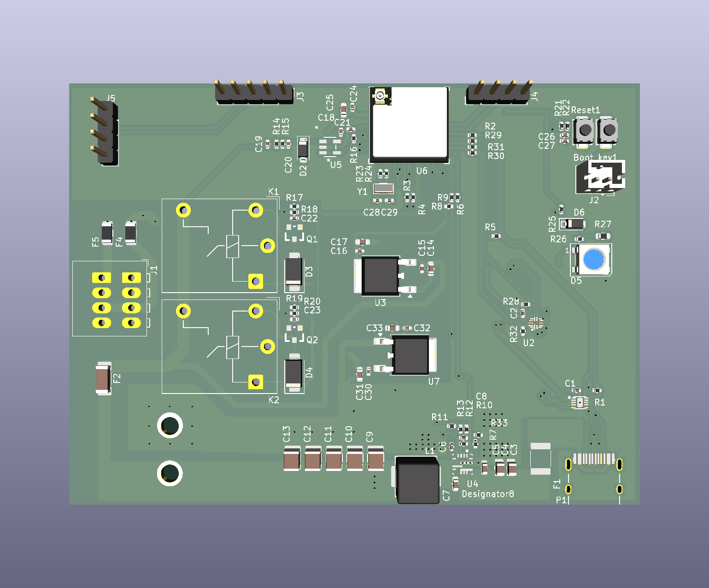

# EnvDaQ Box

This is a development board designed for automated flower watering or smart agriculture, primarily used for controlling the watering and lighting systems. It is currently under development.
The development board utilizes Espressif Systems' ESP32-C6 as the main controller. This SoC is based on the RISC-V architecture core and supports ultra-low power consumption and WiFi-6 (802.11ax).

## 3D model

